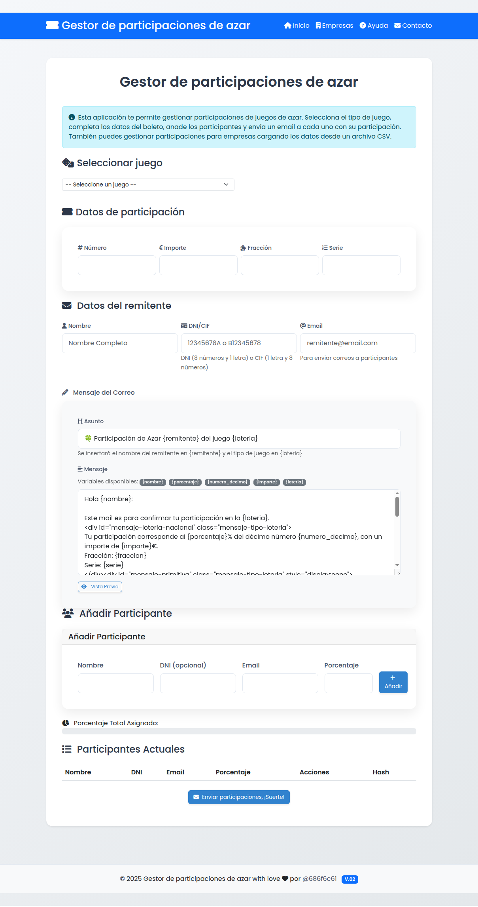
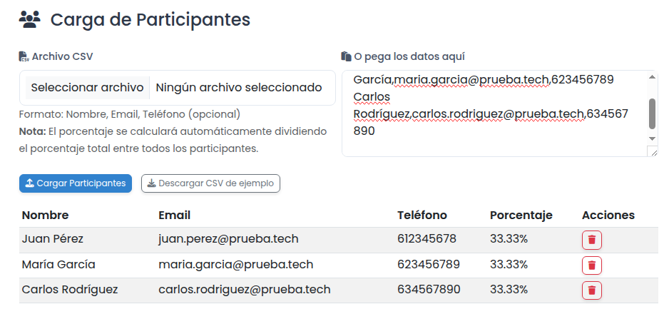

# 🎟️ Gestor de participaciones de juegos de azar

## 📝 Descripción del proyecto

Este proyecto es un gestor de participaciones para diversos juegos de azar. Permite a los usuarios crear y administrar participaciones, enviar correos electrónicos a los participantes con sus detalles de participación 📧, y generar PDFs con resúmenes de las participaciones 📄. Además, incluye una funcionalidad especial para empresas que permite gestionar participaciones para múltiples empleados o clientes a la vez.



La aplicación ofrece dos modos principales de operación:

1. **Modo Individual**: Para gestionar participaciones persona a persona
2. **Modo Empresa**: Para gestionar múltiples participaciones a través de una empresa

## 🛠️ Tecnologías utilizadas

-   **Backend**: Python con Flask
-     **Frontend**: HTML, CSS, JavaScript, Bootstrap
-  **Generación de PDFs**: ReportLab
-  **Envío de correos**: Resend API
-  **Seguridad**: Google reCAPTCHA para el formulario de contacto

## 📦 Dependencias

Las principales dependencias del proyecto son:

- Flask==3.0.0
- reportlab==4.0.7
- gunicorn==21.2.0
- python-dotenv==1.0.1
- resend==0.7.2
- Pillow==11.2.1

Para instalar todas las dependencias, ejecuta:

```bash
pip install -r requirements.txt
```


## ⚙️ Configuración del entorno

El proyecto utiliza variables de entorno para la configuración. Crea un archivo `.env` en la raíz del proyecto con el siguiente contenido:

```
RESEND_API_KEY=tu_api_key_de_resend
EMAIL_DOMAIN=tu_dominio_de_email
DEFAULT_FROM_EMAIL=juego-azar@tu_dominio.com
EMPRESAS_FROM_EMAIL=empresas@tu_dominio.com
CONTACTO_FROM_EMAIL=contacto@tu_dominio.com
RECAPTCHA_SITE_KEY=tu_clave_de_sitio_recaptcha
RECAPTCHA_SECRET_KEY=tu_clave_secreta_recaptcha
```

Asegúrate de reemplazar los valores con tu configuración real.

## 🗄️ Base de Datos

Este proyecto no utiliza una base de datos persistente. Todos los datos se manejan en memoria durante la ejecución de la aplicación.

## 🚀 Cómo ejecutar el proyecto

1. Clona el repositorio:
   ```bash
   git clone https://github.com/tu-usuario/envio-loteria.git
   cd envio-loteria
   ```

2. Crea y activa un entorno virtual (recomendado):
   ```bash
   python -m venv venv
   source venv/bin/activate  # En Windows: venv\Scripts\activate
   ```

3. Instala las dependencias:
   ```bash
   pip install -r requirements.txt
   ```

4. Configura el archivo `.env` como se describió anteriormente

5. Ejecuta la aplicación:
   ```bash
   ./run.sh
   ```
   O directamente con Python:
   ```bash
   python app.py
   ```

La aplicación estará disponible en `http://localhost:5000`.

### Despliegue en producción

Para desplegar en un entorno de producción, se recomienda usar Gunicorn:

```bash
gunicorn --bind 0.0.0.0:8000 wsgi:app
```

Y configurar un servidor web como Nginx como proxy inverso.

## 📂 Estructura del proyecto

- `app.py`: Contiene la lógica principal del backend
- `templates/`: Directorio con las plantillas HTML
  - `index.html`: Página principal para gestión individual de participaciones
  - `empresas.html`: Página para gestión de participaciones empresariales
  - `ayuda.html`: Página de ayuda con instrucciones detalladas
  - `contacto.html`: Formulario de contacto con captcha
  - `base.html`: Plantilla base con la estructura común
- `static/`: Directorio con archivos estáticos (CSS, JavaScript, ejemplos)
  - `ejemplo_participantes.csv`: Archivo CSV de ejemplo para la carga de participantes
- `requirements.txt`: Lista de dependencias del proyecto
- `.env`: Archivo de configuración con variables de entorno (no incluido en el repositorio)
- `run.sh`: Script para iniciar la aplicación

## 🤝 Contribuciones

¡Las contribuciones son bienvenidas! Si deseas contribuir al proyecto:

1. Haz un fork del repositorio
2. Crea una nueva rama para tu feature: `git checkout -b feature/AmazingFeature`
3. Haz commit de tus cambios: `git commit -m 'Add some AmazingFeature'`
4. Push a la rama: `git push origin feature/AmazingFeature`
5. Abre un Pull Request

Por favor, asegúrate de actualizar las pruebas según corresponda y de seguir el estilo de código existente.

## 📄 Licencia

Este proyecto está bajo la licencia MIT. Consulta el archivo `LICENSE` para más detalles.

## 📬 Contacto y soporte

Si tienes alguna pregunta, sugerencia o encuentras algún problema, puedes:

- Utilizar el formulario de contacto integrado en la aplicación
- Abrir un issue en este repositorio
- Contactar directamente al equipo de desarrollo en support@tudominio.com

### Preguntas frecuentes

1. **¿Los datos de los participantes se guardan en algún servidor?**
   No, los datos solo se utilizan para generar los PDFs y enviar los correos electrónicos. No se almacenan permanentemente.

2. **¿Puedo personalizar el diseño de los PDFs?**
   La personalización básica está disponible a través del logo de empresa. Para personalizaciones más avanzadas, contacta al equipo de desarrollo.

3. **¿Hay límite en el número de participantes que puedo gestionar?**
   No hay un límite estricto, pero se recomienda no exceder los 500 participantes por lote para un rendimiento óptimo.

4. **¿Qué hago si un participante no recibe el correo electrónico?**
   Verifica que la dirección de correo sea correcta y revisa la carpeta de spam. Si el problema persiste, utiliza el formulario de contacto para reportar el incidente.

## 🎮 Tipos de juegos de azar soportados

La aplicación soporta una amplia variedad de juegos de azar, cada uno con sus campos específicos:

### LOAE (Loterías y Apuestas del Estado)

- **Lotería de Navidad**:
  - Número del décimo (5 dígitos)
  - Fracción (opcional)
  - Serie (opcional)
  - Importe de participación

- **Lotería del Niño**:
  - Número del décimo (5 dígitos)
  - Fracción (opcional)
  - Serie (opcional)
  - Importe de participación

- **Lotería Nacional**:
  - Número del décimo (5 dígitos)
  - Fracción (opcional)
  - Serie (opcional)
  - Importe de participación

- **La Primitiva**:
  - Números seleccionados (6 números del 1 al 49)
  - Complementario (opcional)
  - Reintegro (opcional)
  - Importe de participación

- **Bonoloto**:
  - Números seleccionados (6 números del 1 al 49)
  - Complementario (opcional)
  - Reintegro (opcional)
  - Importe de participación

- **Euromillones**:
  - Números seleccionados (5 números del 1 al 50)
  - Estrellas (2 números del 1 al 12)
  - Importe de participación

- **El Gordo**:
  - Números seleccionados (5 números del 1 al 54)
  - Número clave (1 número del 0 al 9)
  - Importe de participación

### ONCE

- **Cuponazo**:
  - Número del cupón (5 dígitos)
  - Serie (opcional)
  - Importe de participación

- **Sorteo Extraordinario**:
  - Número del cupón (5 dígitos)
  - Serie (opcional)
  - Importe de participación

- **Cupón Diario**:
  - Número del cupón (5 dígitos)
  - Serie (opcional)
  - Importe de participación

- **Sueldazo Fin de Semana**:
  - Número del cupón (5 dígitos)
  - Serie (opcional)
  - Importe de participación

- **Eurojackpot**:
  - Números seleccionados (5 números del 1 al 50)
  - Soles (2 números del 1 al 12)
  - Importe de participación

### Otros
- Opción para especificar cualquier otro juego no listado
- Campos personalizables según el tipo de juego

## 🏢 Funcionalidad para empresas

La sección de empresas permite gestionar participaciones para múltiples personas de manera eficiente:



### Características principales:

- **Carga masiva de participantes**: 
  - Desde un archivo CSV con formato específico
  - Pegando datos directamente en un área de texto
  - Añadiendo participantes manualmente uno a uno

- **Personalización corporativa**:
  - Añadir el logotipo de la empresa que aparecerá en los PDFs
  - Incluir el CIF de la empresa para fines legales
  - Personalizar el asunto y cuerpo del correo electrónico para todos los participantes

- **Gestión avanzada**:
  - Configurar el porcentaje de participación para cada persona
  - Enviar correos electrónicos personalizados a todos los participantes
  - Recibir un PDF de resumen con todas las participaciones enviadas

### Formato del archivo CSV

El archivo CSV debe tener el siguiente formato (sin encabezados):

```
nombre,email,porcentaje
Juan Pérez,juan.perez@ejemplo.com,10
María García,maria.garcia@ejemplo.com,15
Carlos Rodríguez,carlos.rodriguez@ejemplo.com,20
```

Donde:
- **nombre**: Nombre completo del participante
- **email**: Dirección de correo electrónico válida
- **porcentaje**: Porcentaje de participación (número entero o decimal)

## 📄 Documentos PDF generados

La aplicación genera dos tipos de documentos PDF:

### 1. PDF para participantes

Cada participante recibe un PDF personalizado con los siguientes campos:

- **Datos del juego**:
  - Tipo de juego (Lotería de Navidad, Primitiva, Euromillones, etc.)
  - Número/s del boleto o décimo
  - Importe de la participación
  - Fracción y serie (cuando aplica)
  - Estrellas (para Euromillones)

- **Datos del remitente**:
  - Nombre del remitente o responsable
  - DNI/CIF según corresponda
  - Correo electrónico de contacto

- **Datos del participante**:
  - Nombre del participante
  - Porcentaje de participación
  - Importe correspondiente a su participación

- **Datos de verificación**:
  - Hash único de verificación
  - Fecha y hora de emisión
  - Código QR (si está habilitado)

- **Datos de empresa** (solo en modo empresa):
  - Nombre de la empresa
  - CIF de la empresa
  - Logo de la empresa (si se ha proporcionado)

### 2. PDF de resumen para el administrador

En el modo empresa, el administrador recibe un PDF de resumen con:

- Lista completa de todos los participantes
- Porcentajes e importes asignados a cada uno
- Datos completos del juego
- Información de la empresa
- Estadísticas de envío (emails enviados, fallidos, etc.)

## 🔐 Seguridad y verificación

### Hash de verificación
Cada PDF generado incluye un hash único de verificación que garantiza la autenticidad del documento. Este hash se genera a partir de los datos del participante, el número del boleto y el tipo de juego, lo que hace que cada participación sea única y verificable.

### Política de datos
La aplicación no almacena permanentemente ningún dato personal. Los datos de participaciones se eliminan automáticamente después de 24 horas por motivos de seguridad.

### Formulario de contacto seguro
El formulario de contacto está protegido con Google reCAPTCHA para prevenir spam y abusos.
